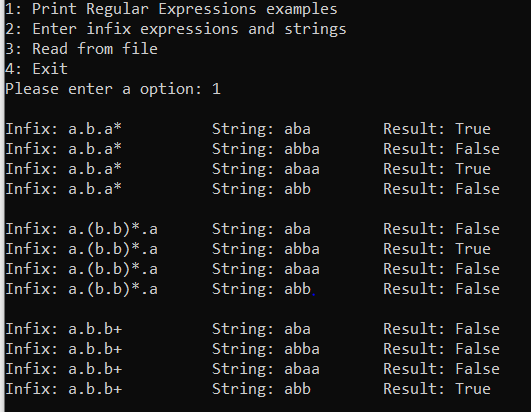
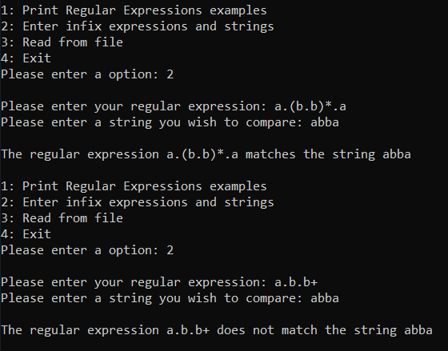
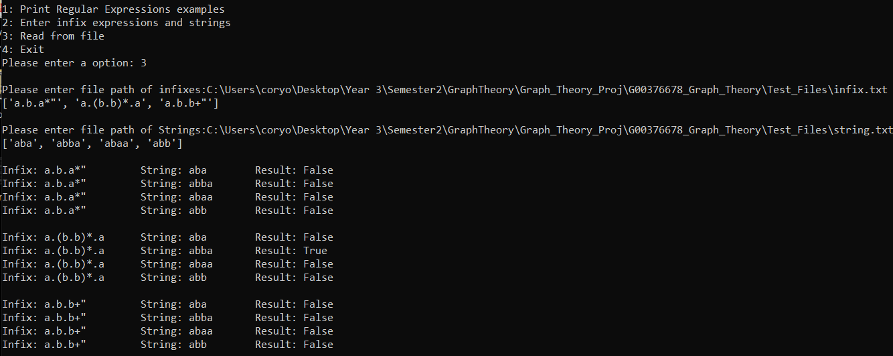
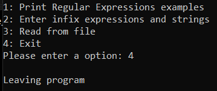

## Cory O'Donoghue
## G00376678
An application written in python3 to search a text file using a regular expression. This program takes a regular expression and the name or path of the file as command line arguments and output the lines of the file matching the regular expression.

## Instructions
To run the application:
* Have python installed and set up on your machine 
* Clone the repo to your machine - git clone https://github.com/Cory53412/G00376678_Graph_Theory
* cd into G00376678_Graph_Theory
* Have a script editor like Visual Studio code
* Run application from cmd using command 'python menu.py'

## User Guide
When the application has been ran using the command 'python menu.py' a menu with 4 options will be displayed to the user
1) It gives them the option to view some examples of regular expressions.
2) It allows the user to enter their own regular expression followed by a string they want to match.
3) Lets the user enter in a file directory for regular expressions and a file directory for string comparisons.
4) Exit the program.
#### Option 1 example

#### Option 2 example

#### Option 3 example

#### Option 4 example

## Explanation of the algorithm
#### Converting infix to postifx using Shunting Yard algorithm (shunt function)
To convert an infix expression into a postfix expression we use a stack to hold the operators and reverse their order in the expression. All the operands are printed when they are read. Below are the rules to handle operators and parentheses which you can find here along with examples from 
[The Departments of Mathematics and Computer Science](http://mathcenter.oxford.emory.edu/site/cs171/shuntingYardAlgorithm/).
* If the incoming symbols is an operand, print it..
* If the incoming symbol is a left parenthesis, push it on the stack.
* If the incoming symbol is a right parenthesis: discard the right parenthesis, pop and print the stack symbols until you see a left parenthesis. Pop the left parenthesis and discard it.
* If the incoming symbol is an operator and the stack is empty or contains a left parenthesis on top, push the incoming operator onto the stack.
* If the incoming symbol is an operator and has either higher precedence than the operator on the top of the stack, or has the same precedence as the operator on the top of the stack and is right associative -- push it on the stack.
* If the incoming symbol is an operator and has either lower precedence than the operator on the top of the stack, or has the same precedence as the operator on the top of the stack and is left associative -- continue to pop the stack until this is not true. Then, push the incoming operator.
* At the end of the expression, pop and print all operators on the stack. (No parentheses should remain.)
[Add image below]

#### Creating an NFA using Thompsons Construction Algorithm (re_to_nfa function)
Once the shunting yard algorithm has created the postfix notation, we use an algorithm called thompsons construction which iterates through the postfix expression. It checks for each operator (* + . |) and creates a small NFA to add to the overall stack. These work by setting up initial and accept states using NFA class and constructor. I discuss how these operators work briefly further down.
[Add image below]

#### Match() function
This function converts the infix expression into a postfix and checks if the regular expression matches the given string of text. It gets the postfix by calling re_to_nfa(). It then creates a current set of states and a previous set of states. Afterwards looping through the states and follows e arrows of the current state.
This is implemented using the followes function which is talked about below. For each character in the string iterate through the current set to check if the set contains the character, if so, add the next states you could travel to. At the end if the current set contains the accept state then it returns true, if not then returns false and the string doesn’t match the NFA.
[Add image below]

#### followes() function
This function takes in the current state and the state to be checked. It ensures both edges are followed

## UI Functions
#### Infix_Examples()
This function displays several regular expressions, possible matching strings and their NFA result. A nested for loop goes through the array of infixes and strings passing each of them through to match() function and printing the output to console.

#### User_Input()
This function asks the user to enter a regular expression, once they've enter their regex then the program asks the user to enter a string. The function will then return a message to the user telling stating if the two entries match or not.

#### File_Input()
This function asks the user to enter a directory of a file they wish to read consisting of infix values which the contents of will be printed to screen, the user will then be asked to repeat the previous task but enter a file directory for strings which the contents of will also be printed to screen. The program will then run through a nested for loop printing the infix, string and the NFA result.

## What is a regular expression?
Regular expression originated in 1951, a mathematician Stephen Cole Kleene described regular languages using his mathematical notation called regular events. A regular expression which can be shortened to regex is a string of text that allows you to create patterns that help match, locate, and manage text. These strings are compared to this pattern to see if they fit the pattern defined by the expression. Regex is a combination of two types of characters, literals and special characters. These characters define the logical pattern. Literals are all characters except those with special meanings. In total there are twelve characters with special meanings. These are '\' , '^', '$' , '.' , '|' , '?' , '*' , '+' , '(' , ')' '{' '[]' 

Special character meanings:
* \ -Backslash escape characters
* ^-Carpet is the anchor for start of the string
* $-The dollar sign is the anchor for the end of the string
* .-The dot matches any character except newline symbol 
* |-Separates a series of alternatives
* ?-Question mark is the match one or more quantifier
* *-Asterisk is the match zero or more quantifier
* +-Plus is the match one or more quantifier
* <>- Smaller and greater signs are anchors that specify a left or right word boundary
* ()-Opening and closing parentheses are used for grouping characters.
* {}-Opening and closing curly brackets are used as range quantifiers
* []-Opening and closing square brackets define a character class to match a single character

If you were to match a character having special meaning you need to use an escape sequence prefix with a backslash E.g \. matches "." or \+ matches "+".

Regular Expressions consist of constraints, which denote sets of strings and operator symbols that denote operations over these sets. Given a finite alphabet Σ, the following constants are defined as regular expressions:

* Empty set-∅ denoting the set ∅.
* Empty string- ε denoting the set containing only the "empty" string, which has no characters at all
* Literal character -  ε denoting the set containing only the "empty" string, which has no characters at all
* Kleene star - R* denotes the smallest super set of the set described by R that contains ε and is closed under string concatenation.
* Concatenation-(RS) denotes the set of strings that can be obtained by concatenating a string accepted by R and a string accepted by S.
* Alternation-(R|S) denotes the set union of sets described by R and S.

## How do regular expressions differ across implementations?
Regular expressions can be implemented as either a Deterministic Finite Automaton (DFA) or a Non-Deterministic Finite Automaton (NFA). The NFA engine is more frequently used in tools such as .Net languages, PHP, Ruby, Perl, Python. However DFA engines are found in almost all versions of egrep and awk.
Both engines are capable of converting an NFA to a DFA and vice versa but they are not same.
Three main differences between DFA and NFA are:
1) 
* DFA: If we pass any symbol in DFA, it can have a transition from the current state to only one other state which satisfies the condition, i.e it can be one state at a time
* NFA: If we pass any symbol, it can have a transition to multiple states, all those states which satisfies the condition, i.e it can be multiple states at the same time
2)
* In DFA we cannot use empty string transition i.e we can not use epsilon to go from one state to another
* In NFA we can use empty string transition i.e we use epsilon to move from one state to a different state or from one state to multiple states
3)
* DFA requires more space
* NFA requires less space

DFA and NFA both have a set of five tuples however both are represented differently
Deterministic Finite Automaton are represented as:
Q: A non empty finite set of states present in the finite control(qo, q1, q2, …). 
Σ: A non empty finite set of input symbols. 
δ: It is a transition function that takes two arguments, a state and an input symbol, it returns a single state. 
qo: It is starting state, one of the state in Q. 
F: It is non-empty set of final states/ accepting states from the set belonging to Q. 

Non-Deterministic Finite Automaton are represented as:
Q: A set of non empty finite states. 
Σ: A set of non empty finite input symbols. 
δ: It is a transition function that takes a state from Q and an input symbol from and returns a subset of Q. 
qo: Initial state of NFA and member of Q. 
F: A non-empty set of final states and member of Q. 

## Can all formal languages be encoded as regular expressions?
A formal language consists of a set of strings drawn from a finite alphabet and are formed to a specific set of rules. This alphabet is formed of symbols(operators) and letters(operands)  and the specified set of rules can be from regular expression.

## Research
#### Shunting Yard 
In week 6 of the course I was introduced to the Shunting Yard Algorithm, to ensure I fully understood the algorithm, as the concept of the stack and its various operator precedence was still not quite clear to me. I ended up discovering a very useful  [video](https://www.youtube.com/watch?v=HJOnJU77EUs)  that went about explaining it in a simple and effective approach. Between the lecture content and and tutorial I had a solid grasp of the algorithm and attempted to take on the second half of the pseudo code pulled from google, however I was not successful in completing the algorithm. The following week Dr Ian mcloughlin completed the code which afterwards I  wrote out a list of infix expressions and their corresponding postfix expression which later tested to check if they were correct.

#### More Regular Expressions and Starting Thompsons Construction
In week 8 we expanded on regular expression operators, began learning about thompsons construction and adapted the previous weeks Shunting Yard algorithm to the new operands which were concatenation: '.',the or: '/', and the kleene star: '*'.  I followed the same technique as the previous week of writing out my own infix to postfix examples to see if my expected result was correct. At the start, thompsons construction was not quite clicking in my head, where following the arrows in the kleene star was leading to new start and accept states and back towards the old start and accept states. This took several reads and videos to grasp, which also lead me to discover DFA's which gave me a better understanding of content later in the course. The most useful I found was this [tutorial](https://www.youtube.com/watch?v=RYNN-tb9WxI) on youtube.

#### Implememnting THompsons Construction in Code
In week 9 we implemented thompsons construction in code. After taking time to get a better grasp of what thompsons construction does and how it creates an NFA in the previous week I had a decent understanding of what was happening. I firstly just followed the lab watching the video trying to understand as best as I could. I then attempted to complete the lab myself reverting the lab video when I needed assistance. 

#### Match Function()
In week 12 we created a match function in the NFA class. I originally followed the lecture video implementing the match function as shown which worked fine. However as I began to try and create my own functions from the menu file, when i was calling the match function it simply would not work. I was repeatedly getting the same error finding no useful help online. So i went and re-watched your labs from the previous year. That year there was a different approach to creating the match function witch I tried, requiring to make some small changes to my Thomposns Algorithm also. The new approach worked enabling me to carry on with the project and successfully finish off the user and file functions.

